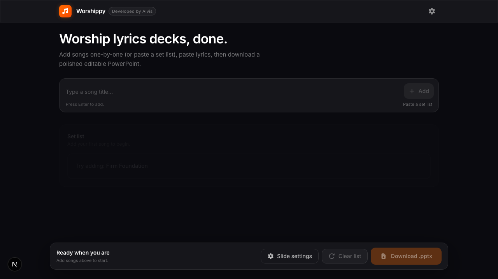
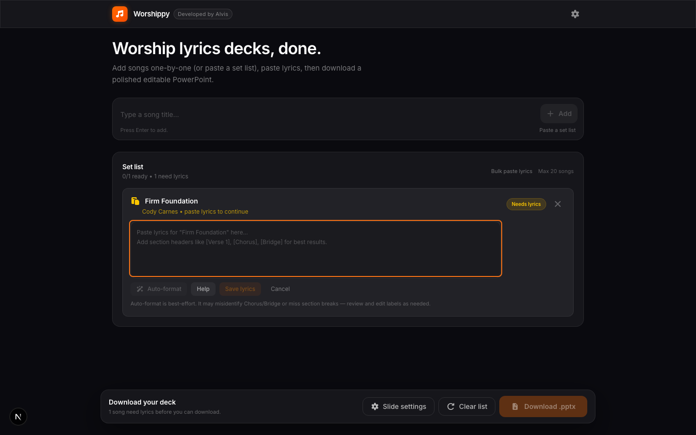
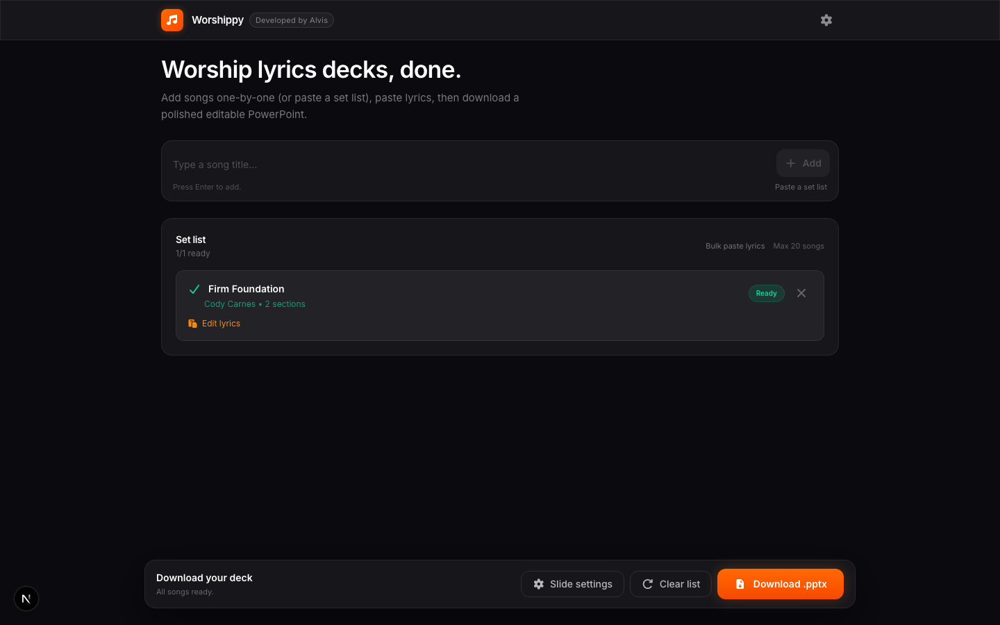
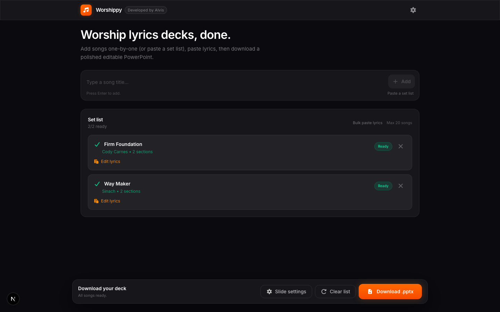

# Worshippy

**Worship lyrics decks, done.** Build a polished PowerPoint presentation for your worship set in minutes — no design skills required.

Add songs one by one or paste a full set list, drop in your lyrics, tweak a few slide settings, and download a clean, editable `.pptx` file ready for Sunday morning.

**[Try it live](https://alvslovescyber.github.io/PPTSlidesGen/)**

---

## Screenshots

### Home — empty state



### Add a song and paste lyrics



### Song ready



### Full set list — all songs ready to download



### Slide settings panel


---

## How it works

1. **Type a song title** (or paste a comma/newline-separated set list) — Worshippy recognises common worship songs and auto-fills the artist name.
2. **Paste the lyrics** — use `[Verse 1]`, `[Chorus]`, `[Bridge]` headers for best results. The auto-format button can add them for you.
3. **Tweak slide settings** — choose lines per slide (2–4), font, lyric size, colour, and margins.
4. **Download** — get a `.pptx` file with one lyric block per slide, ready to open in PowerPoint or Google Slides.

---

## Features

- Search a built-in catalog of hundreds of worship songs — artist names filled in automatically
- Paste a full set list at once with "Paste a set list"
- Bulk-paste lyrics for every song in one modal
- Session auto-save — refresh without losing your work
- Fully client-side — nothing leaves your browser
- Dark, clean UI built for low-light stage environments
- Configurable slide layout: lines per slide, font (Calibri / Aptos / Arial), text size, colour (Soft / Pure), and margins

---

## Running locally

```bash
npm install
npm run dev
```

Open [http://localhost:3000](http://localhost:3000).

```bash
npm run test      # unit tests
npm run lint      # ESLint
npm run format    # Prettier
```

---

## Deployment

The app deploys automatically to GitHub Pages on every push to `main` via `.github/workflows/deploy-pages.yml`. The base path is set dynamically from the repository name, so no manual config is needed after a rename.

---

## Tech stack

- [Next.js 16](https://nextjs.org/) (static export)
- [Tailwind CSS v4](https://tailwindcss.com/)
- [pptxgenjs](https://gitbrent.github.io/PptxGenJS/) for slide generation
- [Framer Motion](https://www.framer.com/motion/) for animations
- [Vitest](https://vitest.dev/) for unit tests
