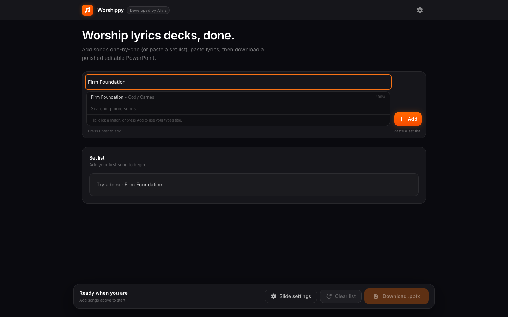
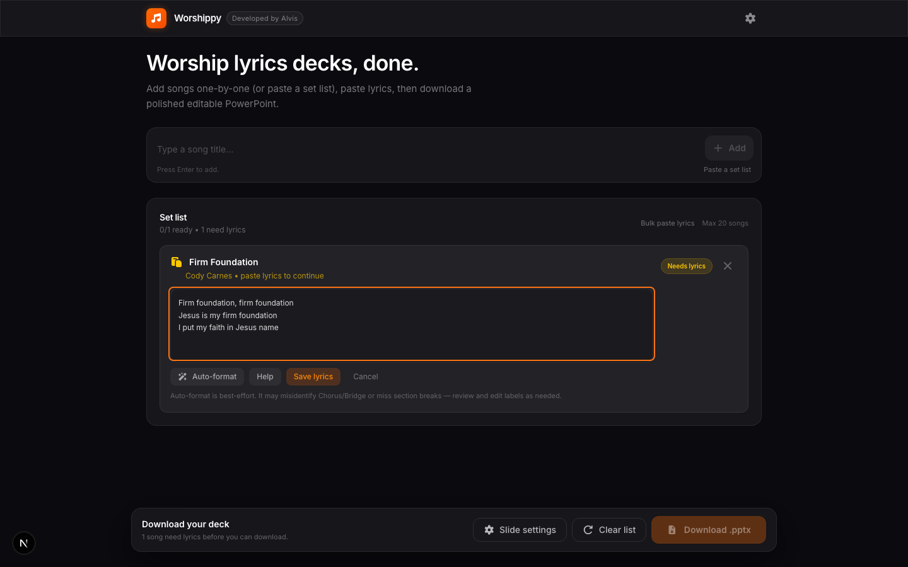

# Worshippy

**Worship lyrics decks, done.** — a fast, browser-only tool for worship leaders to build polished PowerPoint slide decks from song lyrics, with zero sign-up and zero server.

**[Try it live →](https://alvslovescyber.github.io/PPTSlidesGen/)**

---

## What it does

Type a set list, paste lyrics, download a `.pptx`. That's it.

- **Smart song search** — start typing a title and Worshippy matches it against a built-in catalog of worship songs, showing the artist and a confidence score
- **Lyrics editor** — paste raw lyrics with optional section headers like `[Verse 1]`, `[Chorus]`, `[Bridge]` for best slide splits
- **Auto-format** — automatically detects section breaks so you don't have to mark every line
- **Bulk paste** — paste lyrics for all songs at once from a single modal
- **Slide settings** — choose lines per slide (2 / 3 / 4), font (Calibri / Aptos / Arial), text size, colour tone, and side margins
- **Fully editable output** — the downloaded `.pptx` is a standard PowerPoint file, so your team can tweak it in any presentation app
- **Session autosave** — your set list is saved in `sessionStorage` and restored if you accidentally refresh the tab
- **No backend, no account** — everything runs in the browser; nothing leaves your device

---

## Screenshots

### Home — empty state


### Song search with autocomplete



### Adding a song and pasting lyrics




### Slide settings panel


### Song ready to download


### Full set list ready


---

## How to use

1. **Type a song title** in the search box and press Enter (or click a suggestion)
2. **Paste lyrics** into the editor that opens below the song card — add `[Verse 1]`, `[Chorus]` etc. for better slide breaks, or hit **Auto-format** to let Worshippy guess the structure
3. **Repeat** for each song in your set
4. Optionally open **Slide settings** to customise font, size, lines per slide and margins
5. Hit **Download .pptx** — a ready-to-present PowerPoint lands in your Downloads folder

> **Tip:** Got a full set list? Click **Paste a set list** to add all songs at once, then use **Bulk paste lyrics** to fill them in one go.

---

## Running locally

```bash
npm install
npm run dev
```

Open [http://localhost:3000](http://localhost:3000).

### Other scripts

| Command | Description |
|---|---|
| `npm run build` | Production build |
| `npm run test` | Run unit tests (Vitest) |
| `npm run lint` | ESLint |
| `npm run format` | Prettier |

---

## Tech stack

- [Next.js 16](https://nextjs.org/) (static export for GitHub Pages)
- [React 19](https://react.dev/)
- [Tailwind CSS v4](https://tailwindcss.com/)
- [PptxGenJS](https://gitbrent.github.io/PptxGenJS/) for `.pptx` generation
- [Framer Motion](https://www.framer.com/motion/) for animations
- [Font Awesome](https://fontawesome.com/) icons
- [Vitest](https://vitest.dev/) for testing

---

Built by [Alvis](https://github.com/alvslovescyber).
